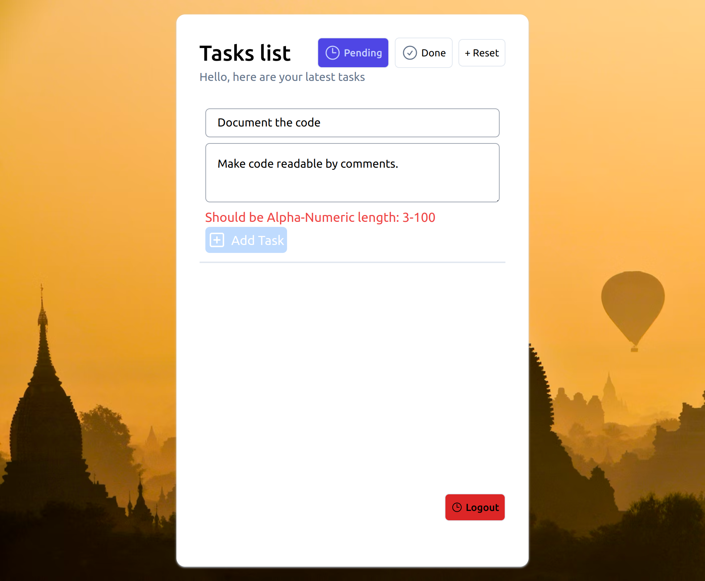
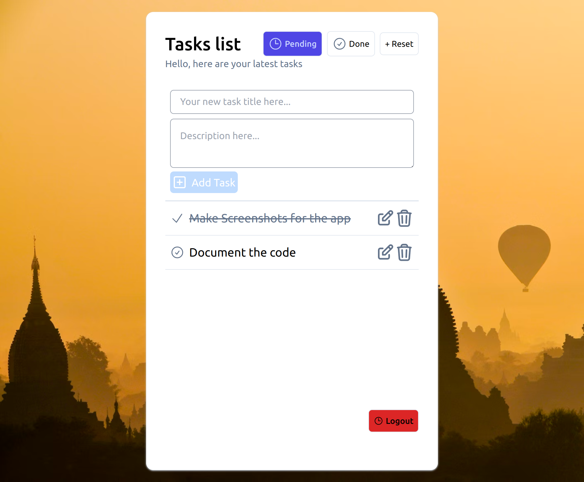
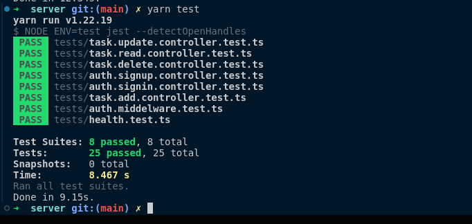
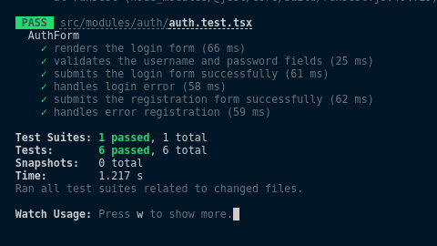
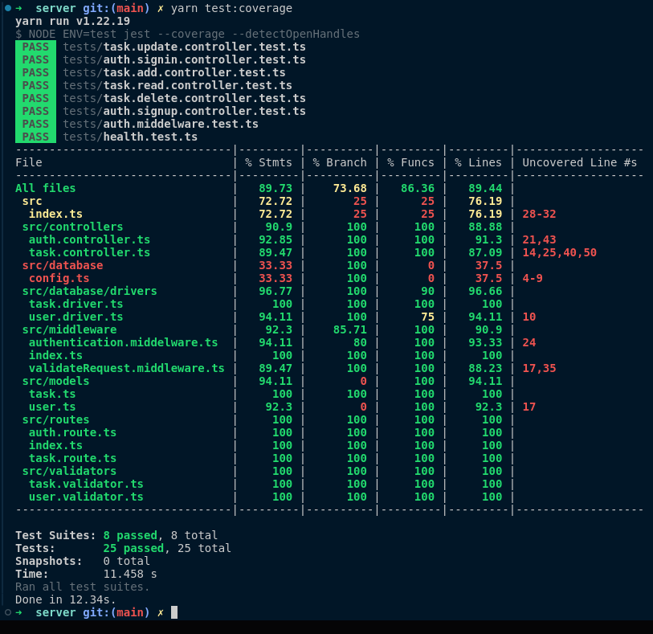

# technical-test-c4

## Objective
Create a CRUD application for task management that includes user authentication and offers a visually
appealing user interface. Each task should have attributes like title, description, and status (e.g., pending,
completed).

## Installation:
- it is recommended to use latest nodejs stable version
- during the development of this app, i used `node v20.13.1`
- use the frozen lockfile to install the exact version
```shell
git clone https://github.com/aallali/technical-test-c4
cd technical-test-c4
## install and run api
cd server 
yarn ci
yarn start
## install and run ui
cd ../ui
yarn ci
yarn start
```
## Tech Stack
- **Ui** : `React.Js`, `TypeScript`, `Tailwind`, `Zustand`
- **Server**: `Node.Js`, `TypeScript`, `Express.Js`, `Mongoose`
- **Db**: `MongoDb`
---

## Screenshots:





- Api unit tests




## UI
### Folder structure
```
src
├── App.tsx
├── index.css
├── index.tsx
├── modules
│   ├── auth
│   │   ├── assets
│   │   │   └── lock.png
│   │   ├── auth.api.ts
│   │   ├── auth.config.ts
│   │   ├── auth.store.ts
│   │   ├── auth.validator.ts
│   │   └── Index.tsx
│   └── tasks
│       ├── index.tsx
│       ├── task.api.ts
│       └── task.validator.ts
├── react-app-env.d.ts
├── setupTests.ts
└── utils
    └── axios.ts

5 directories, 15 files
```
### Test :
- **command: `yarn test`**



### Todo:
- [x] : setup skeleton
- [x] : wait until server is done...
- [x] : create login
- [x] : test login component
- [x] : create new task input component
- [x] : update task [title, description, status] functionlity
- [x] : delete task 
- [x] : fetch all tasks
- [x] : tasks filter on browser
- [ ] : write tests for remaining components
- [x] : add some screenshots to readme
---
## Server
### Test Coverage:
- **command: `yarn test:coverage`**



### Models:
- **User Model**:
```js
const UserSchema: Schema = new Schema({
  username: { type: String, required: true, unique: true },
  password: { type: String, required: true },
});
```
- **Task Model**:
```js
const TaskSchema: Schema = new Schema({
    title: { type: String, required: true },
    description: { type: String },
    status: {
        type: String,
        enum: ['pending', 'done'],
        default: 'pending'
    },
    userId: { type: Types.ObjectId, ref: 'User', required: true },

}, {
    timestamps: { createdAt: 'created_at', updatedAt: 'updated_at' }
});
```
### Routes:
```txt
POST    : /api/v1/auth/signin   : login
POST    : /api/v1/auth/signup   : register
GET     : /api/v1/auth/whoami   : fetch info of current authorized user

POST    : /api/v1/task/         : create new task
PATCH   : /api/v1/task/         : update task
DELETE  : /api/v1/task/{taskId} : delete a task
GET     : /api/v1/task/         : fetch all tasks
```

### Api Testing Collection

- please use [this collection](./postmanCollection/requestsTests.postman_collection.json)

### Folder structure
```
├── nodemon.json
├── package.json
├── src
│   ├── controllers
│   │   ├── auth.controller.ts
│   │   └── task.controller.ts
│   ├── database
│   │   ├── config.ts
│   │   └── drivers
│   │       ├── task.driver.ts
│   │       └── user.driver.ts
│   ├── index.ts
│   ├── middleware
│   │   ├── authentication.middelware.ts
│   │   ├── index.ts
│   │   └── validateRequest.middleware.ts
│   ├── models
│   │   ├── task.ts
│   │   └── user.ts
│   ├── routes
│   │   ├── auth.route.ts
│   │   ├── index.ts
│   │   └── task.route.ts
│   ├── types
│   │   └── index.ts
│   └── validators
│       ├── task.validator.ts
│       └── user.validator.ts
├── tests
│   ├── auth.middelware.test.ts
│   ├── auth.signin.controller.test.ts
│   ├── auth.signup.controller.test.ts
│   ├── health.test.ts
│   ├── task.add.controller.test.ts
│   ├── task.delete.controller.test.ts
│   ├── task.read.controller.test.ts
│   └── task.update.controller.test.ts
├── tsconfig.json
└── yarn.lock
```
### Todo:
- [x] : setup skeleton
- [x] : setup jest for Unite test
- [x] : integrate mongoose
- [x] : setup DB drivers
- [x] : setup jwt auth system (user+pass, **`no email`**)
- [x] : setup auth middleware and test it
- [x] : create units tests for the auth flow
- follow TDD approach
- [x] service: **add task**
    - [x] create unit test
    - [x] create the service
- [x] - service: **update task** 
    - [x] create unit test
    - [x] create the service
- [x] - service: **delete task**
    - [x] create unit test
    - [x] create the service
- [x] - service: **read tasks** 
    - [x] create unit test
    - [x] create the service
- [x] - document the roadmap
